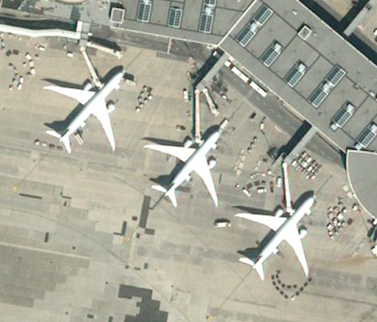

# Aircraft Tagging

> Version 2020-11-10

## Geometry

Aircrafts surch as planes and helicopters should be identified with a polygon on the imagery. The polygon should be as tight as possible i.e. using the minimum number of points possible while fully covering the aircraft. For the sake of precision, the points should be located on the object itself. 

Exemple for plane:

  

Exemple for helicopter:

  

In some cases, you might need to use more than 5 points. **The main objective is to make sure that the polygon encompass the whole aircraft**.

## Classes

We focus into **detection** of the aircraft and **classification** of its general type. As such, the aircraft should be classified into the following 6 main categories and potential sub-categories:

- **`small_aircraft`**

  Light aircrafts for leisure, private jets and small passengers aircrafts. 

  This category can have the following sub-categories:

  - **`leisure_aircraft`**

    Aircrafts used for leisure activiy. Most of these aircrafts have propellers. Their length is maximum of 12 m. i.e. 25 pixels on 50cm imagery. This category also includes gliders which have a much larger wingspan.

    
    

  - **`private_jet`**

    This category of small aircrfats has usually maximum two small reactors. In that case, the engines are mounted on the fuselage or body of the plane. They can acommodate up to 16 persons. Their length is between 12 m. and 25 m. i.e. 25 to 50 pixels on 50cm imagery. More information on [Wikipedia](https://en.wikipedia.org/wiki/Business_jet).

    

  - **`regional_commercial`**

    Lighter commercial aircrafts from ATR, Bombardier or Embraer fall in this category. They typically accomodate up to 100 persons maximum. Their length is between 25 m. and 40 m. i.e. 50 to 80 pixels on 50cm imagery. More information on [regional airliners](https://en.wikipedia.org/wiki/List_of_regional_airliners).

    

- **`large_commercial`**

  Large aircrafts from commercial companies carrying more than 100 passengers or cargo. These aircrafts have a length of 40 m. and more (i.e. over 80 pixels on 50cm imagery). Most common commercial aircrafts are manufactured by Airbus (A320, A340, A380) and Boeing (B737, B747, B777). They mostly have two or four reactors mounted under the wings but some have a third reactor on the tail (McDonnell Douglas DC-10). More information on [airliners](https://en.wikipedia.org/wiki/Airliner).

  
  

- **`helicopter`**

  This category includes all helicopters, civilian and military, with single and double rotors. Military helicopters, as civilian ones, are mostly used for transport, observation and rescue but can also be attack helicopters. More information on [helicopters](https://en.wikipedia.org/wiki/Helicopter) and [military helicopters](https://en.wikipedia.org/wiki/Military_helicopter).

  

  This category can have the following sub-class:

    - **`tandem_rotor_helicopter`**

      Tandem rotor helicopters have two large horizontal rotor mounted one in front of the other. Currently this configuration is mainly used for large cargo helicopters. More information in [Wikipedia](https://en.wikipedia.org/wiki/Tandem_rotors)

      
 
- **`fighter`**
  
  This sub-class includes combat aircrafts, military fighters and military jets. Several aircrafts have a **dual-use** as fighter and bomber. These aircrafts should be considered as **`fighter`**. 

  
  

  **Military training aircraft** are smaller than regular fighters. They are not actually fighters but still of military use. They should be annotated in this class if the military use is clear. Otherwise, they should be annotated as **`small_aircraft`**.

- **`bomber`**
  
  This sub-class is for military bombers. They typically have large wingspan, four reactors, thin bulk

  
  

  Bombers only include large and undoubtedly large bombers.

- **`other_large_military`**

  All other large military aircrafts all in this sub-class. They are mainly military transport planes, refuelers and AWACS. They typically have large fuselage to carry tanks or other military equipment. Their shapes are very similar to these of commercial aircrafts so you can use other contextual information to classify them. AWACS are easy to identify thanks to the circular radar above them.

  
  

## Important notes

The length and wingspan of aircrafts and helicopters should be **larger than 10 pixels**. Typical dimensions are given as guidance but flexibility is possible here.

If you encounter objects on the tarmac that might be aircrafts but do not fall in the previous categories, please tag them as **`unknown_aircraft`**.

If an aircraft is not fully visible (i.e. partially covered by a shed or at the border of the imagery), **annotate only the portion that is visible**.

**Do not annotate** blimps (a.k.a zeppelin), hot air balloons, dismantled aircrafts or aircrafts pieces such as an helicopter without blades, an aircraft without wings or wings alone.

**Annotate all aircrafts** including flying aircrafts i.e. not resting on the taxiways. You may notice a chromatic halo close to a flying aircraft as below.

