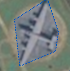
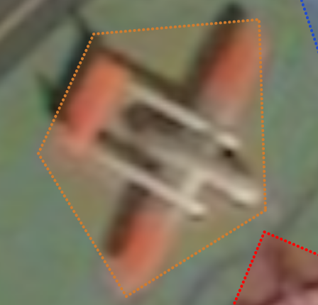

# UNITED STATES OF AMERICA

## BOMBERS 

| Type                   | Photo                                        | Satellite                                    | Reference                      |
|------------------------|----------------------------------------------|----------------------------------------------|--------------------------------|
| Bomber B-1 Rockwell    |  |  | Length=44m Wingspan=42m |
| Bomber B-52            |  |  | Length=49m Wingspan=56m |
| Bomber B-29            |  |  | Length=30m Wingspan=43m |
| Bomber B-47            |  |  | Length=33m Wingspan=35m |
| Fairchild C-82A Packet |  |  | Length=23m Wingspan=32m |
| [Avro Vulcan B2](https://en.wikipedia.org/wiki/Avro_Vulcan)         |  |  | Length=32m Wingspan=32m |

## OTHER MILITARY

| Type                          | Photo                                        | Satellite                                    | Reference                      |
|-------------------------------|----------------------------------------------|----------------------------------------------|--------------------------------|
| Awacs E-3                     |  |  | Length=47m Wingspan=44m |
| E-6 Mercury                   |  |  | Length=46m Wingspan=44m |
| KC-135 Stratotanker           |  |  | Length=42m Wingspan=40m |
| KC-10                         |   |   | Length=55m Wingspan=50m |
| C-5                           |  |  | Length=75m Wingspan=68m |
| C-17 Globemaster III          |  |  | Length=53m Wingspan=52m |
| KC-97                         |  |  | Length=35m Wingspan=43m |
| Douglas C-124 Globemaster     |   |  | Wingspan=53m Length=40m |
| Lockheed U-2                  |  |   | https://en.wikipedia.org/wiki/Lockheed_U-2 |
| Lockheed C130 Hercules        |  |  |  |
| E-2 Hawkeye                   |   |  | https://en.wikipedia.org/wiki/Northrop_Grumman_E-2_Hawkeye |
| Fairchild A-10 Thunderbolt II |  |  | Length=16m Wingspan=18m |

---

# REPUBLIC OF CHINA

## BOMBERS 

| Type                          | Photo                                        | Satellite                                    | Reference                      |
|-------------------------------|----------------------------------------------|----------------------------------------------|--------------------------------|
| Xian H-6 Bomber |  |  | Length=35m Wingspan=33m |

---
# RUSSIA

## BOMBERS 

| Type                          | Photo                                        | Satellite                                    | Reference                      |
|-------------------------------|----------------------------------------------|----------------------------------------------|--------------------------------|
| Sukhoi Su-24M |  |  | Length=25m Wingspan=variable|

## OTHER MILITARY

| Type                          | Photo                                        | Satellite                                    | Reference                      |
|-------------------------------|----------------------------------------------|----------------------------------------------|--------------------------------|
| IL-76 / IL-78 |  |  | Length=47m Wingspan=50m |
| Antonov An-26 |  |  | Length=24m Wingspan=29m |
| Antonov An-12 |  |  | Length=33m Wingspan=38m |
| Antonov An-22 |  |  | Length=58m Wingspan=64m |
| Tupolev Tu-95 |  |  | Length=48m Wingspan=51m |
| Tupolev Tu-160 |  |  | Length=50m Wingspan=52m |
| Tupolev Tu-22 |  |  | Length=41m Wingspan=28 |
| Iliouchine IL-38 |  |  |  |
| Iliouchine IL-62 |  |  | Length=53m Wingspan=43m |
| Tupolev-134 |  |  | Length=37m Wingspan=29m |
| Miassichtchev M-4 |  |  | Length=49m Wingspan=51m |

---

# OTHER COUNTRIES

| Type                          | Photo                                        | Satellite                                    | Reference                      |
|-------------------------------|----------------------------------------------|----------------------------------------------|--------------------------------|
| Airbus A330 MRTT |  |  | Length=59m Wingspan=60m |

