# Ships Tagging

> Version 2019-12-03

## Geometry

This project aims to tag **ships**.

Records should be either annotated as **oriented bounding-box** (i.e. a rectangle or **4-vertices polygon**, with no differentiation between the front and the back of a car) or a **n-points polygon** 

 
    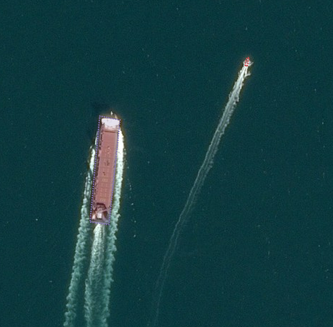

## Classes

A taxonomy has been defined in order to represent the different specific cases a user can encounter.

 
    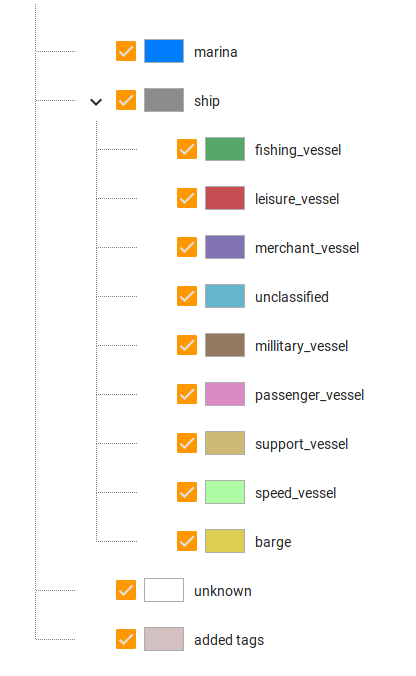

Every record must have either **marina**, **ship** or **unkown** tag. A marina is a dock or basin with moorings and supplies for yachts and small boats. 

 
    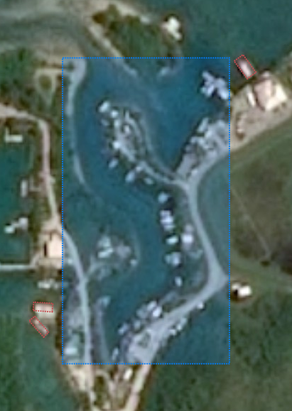
    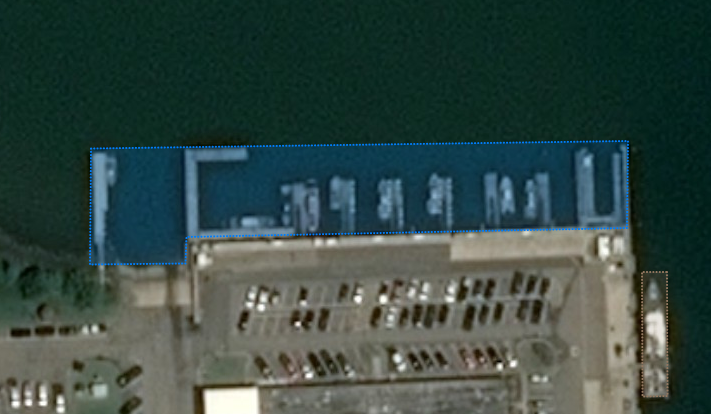

The tag **unknow** is used when the user is sure that the object is neither a **ship**, nor a **marina**. This one should not be used very often.

When the user recognise an object as a **ship**, he may be able to go one step further and find the **class** of the vessel. **8** classes have been selected to represent the whole diversity of the ships that may be encountered. A ninth class has been added, **unclassified**, to be used when the user hesitate between several classes for a single object. For smaller ships, the difference between two ships of different classes are extremely minimal, and often, the context of the scene is used to settle the dispute. Please find the different classes that may be encountered with some examples:

- **Barge**

 
    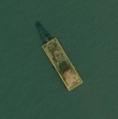
    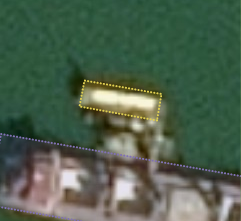
    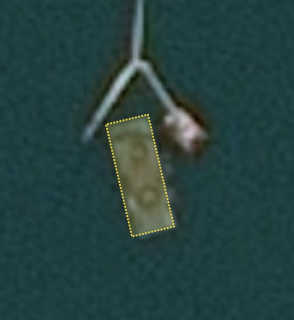

- **Fishing vessel**

 
    
    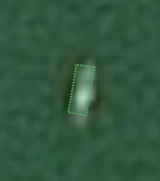
    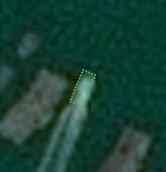

- **Leisure vessel**

 
    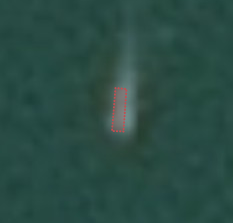
    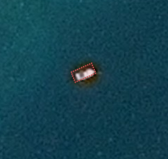
    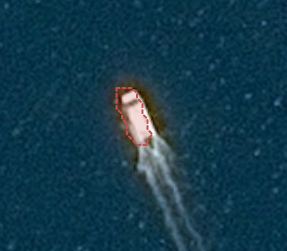

- **Merchant vessel**

 
    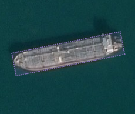
    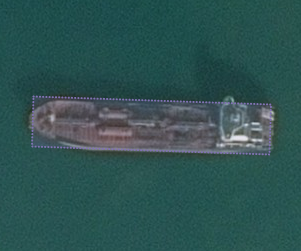
    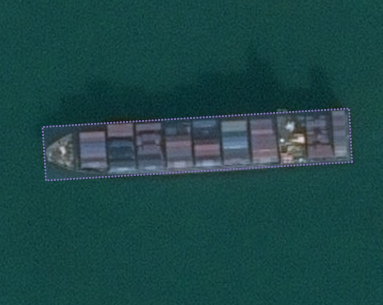
    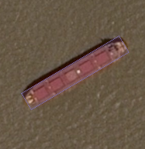

- **Military vessel**

 
    
    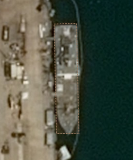
    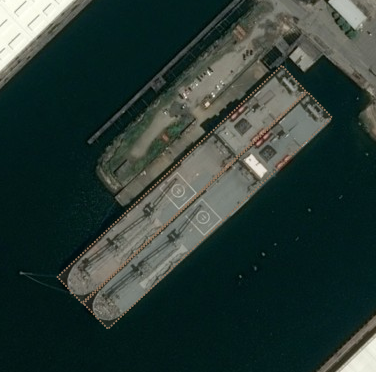
    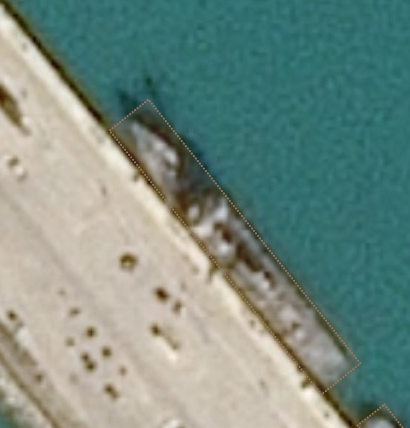

- **Passenger vessel**

 
    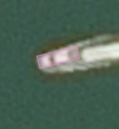
    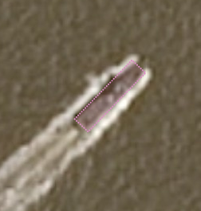
    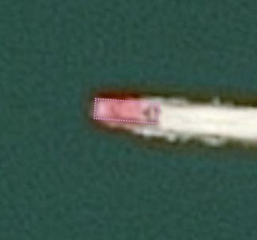

- **Speed vessel**

 
    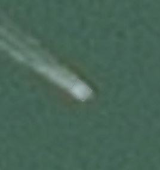
    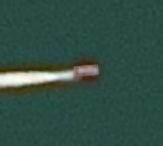
    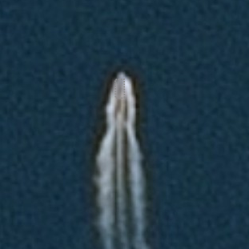

- **Support vessel**

 
    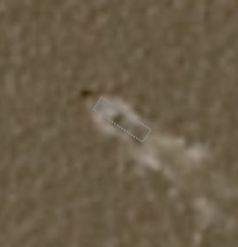
    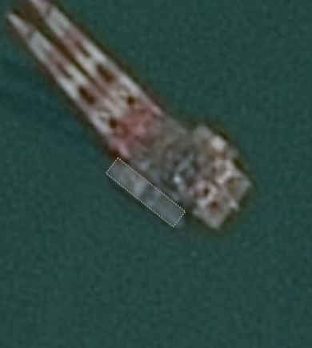
    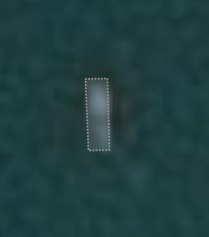
    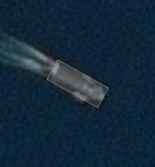

