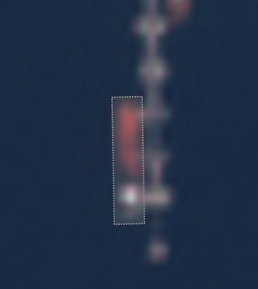
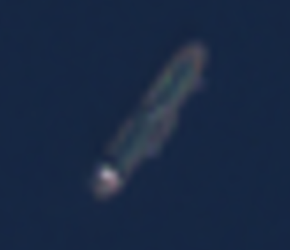
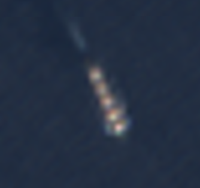

# Ships Tagging on Sentinel-2

> Version 2019-12-12

## Geometry

This project aims to tag **ships** in satellite images, using Sentinel-2 imagery (spatial resolution of 10 meters for red, green and blue bands).

Records should be annotated as an **oriented bounding-box** (with orientation going from back to front of ship) or as a rectangle i.e. a **4-vertices polygon**. 

## Classes

Every record should be classified as **ship**.

**It is not expected to classify the type of ship.**

Due to the resolution of the imagery, the class of the ship can not be determined with confidence. Only large ships can be seen on Sentinel-2 imagery, reducing type of objects to merchant, large military, large passenger vessels and large barges.

## Notes

Please, do **label truncated ships** at the border of the imagery.

## Examples

Find below some examples of ships that can be encountered:

