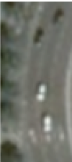
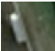
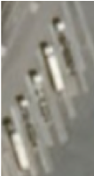
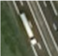

# Vehicles Tagging

> Version 2019-11-06

## Geometry

This project aims to tag **road vehicles**.

Records should be annotated as **oriented bounding-box** (i.e. a rectangle or **4-vertices polygon**, with no differentiation between the front and the back of a car).

## Classes

Every record must have a class attribute of either **car** or **truck**. No records should ever comprise more than one object.

- **Car**

This class includes utility vehicles (i.e. pickup, van)

 

- **Truck**

This class includes generic trucks:

 

trailer trucks:

 

and buses:

 
