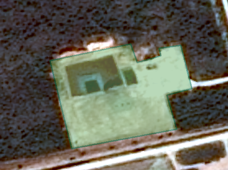
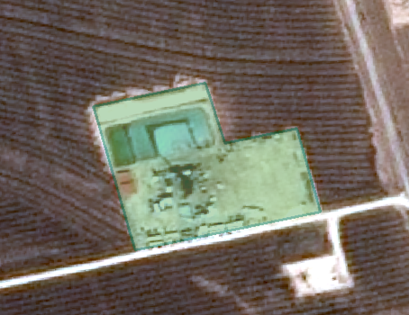
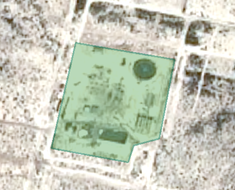
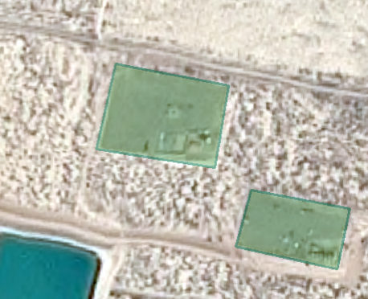
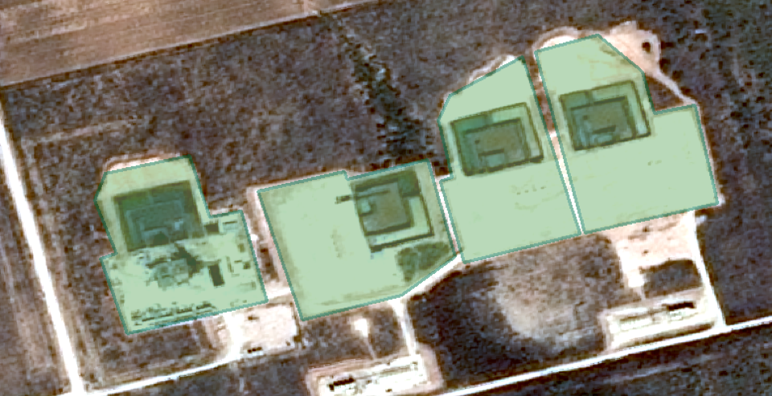
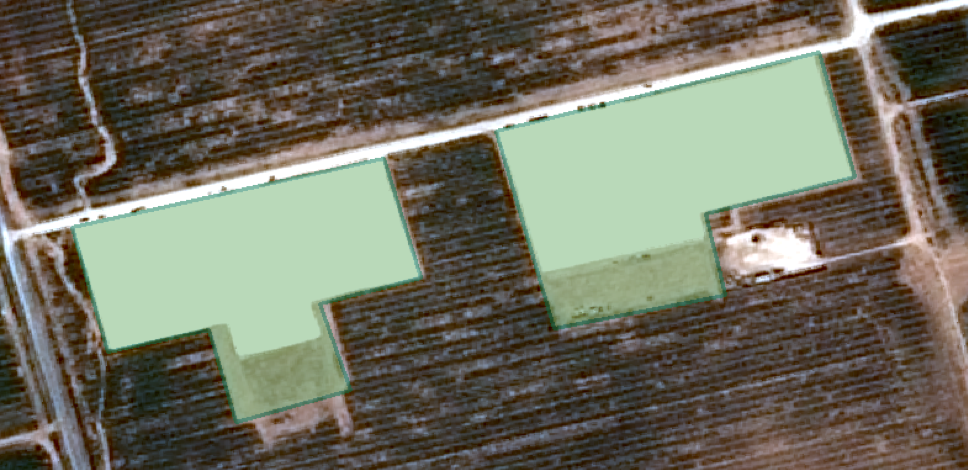

# Well Pads Tagging

> Version 2019-11-06

## Geometry

This project aims to tag **well pads**. Well pads are cleared areas designated for gas and oil extraction. They vary in size and can have a range of equipment and material on them. Most well pads have a rectangular shape and have ponds on the site.

Draw a tight mask around each of the well pads. If the well pad has a pond, include the pond in the mask.  Well pads should be drawn with a minimum of 4 and a maximum of 10 points.  Some well pads can appear in groups while some are singular.

**Map separate units of well pads when they appear in groups.**

