# Well Pads Tagging

> Version 2019-11-08

## Introduction

The aim of this project is to tag all *$well pads** in the satellite images provided, by drawing an outline around their edges. Well pads are cleared areas of land designated for oil and gas extraction and fracking. They vary in shape and size, have clearly defined straight edges and can have a range of equipment and materials on them, including drilling rigs, storage containers and vehicles.

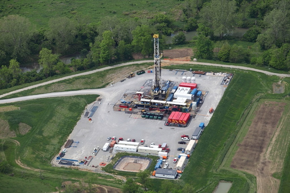
*Photograph of a well pad.*

## Well pad appearance

Satellite imagery is provided that contains numerous well pads. The image below shows a zoomed out view, with well pads circled in red.

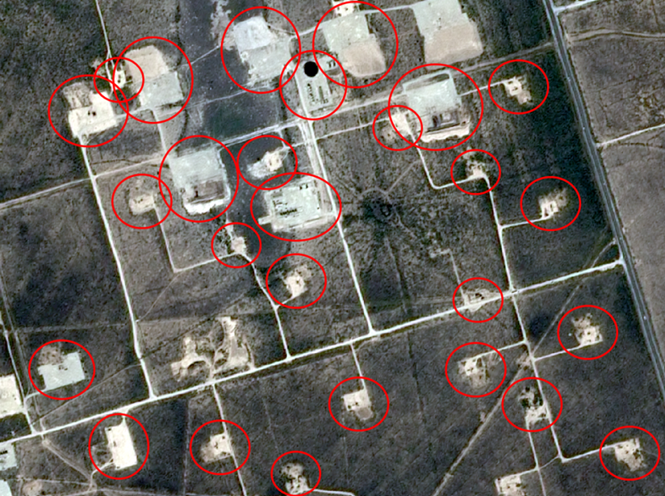

This shows the variety in the shape and size of well pads. Well pads at the edges of the image have not been indicated, as these should not be tagged.

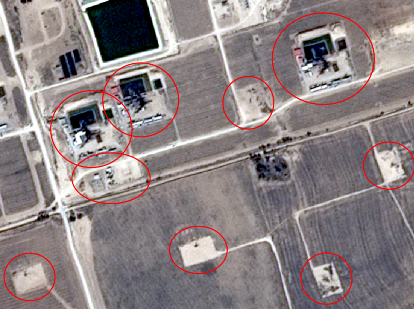

This next image is zoomed slightly more closely than the first, and shows clearly the difference in the sizes of well pads. Pads of all sizes should be tagged. Below are several close-up examples of well pads.

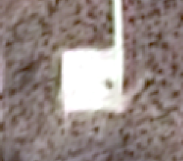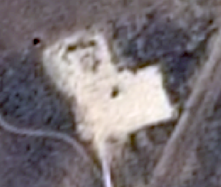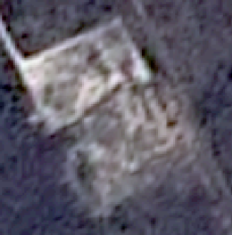

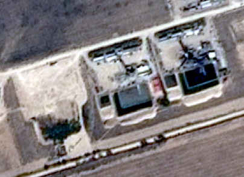

These examples demonstrate that well pads can be square, rectangular or irregularly shaped, usually with clearly defined straight edges.
The example in the bottom left shows a comparison of clear well pads and pads with equipment on them, both of which should be tagged.
Old well pads lose their definition over time as the cleared ground returns to its original state. This can be seen in the top right example above. These pads should still be tagged where possible, as shown below.

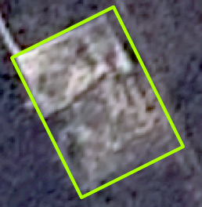

## How to tag

- You can choose the zoom level that feels appropriate. The image below is zoomed to 1:5000 which likely to be suitable, although you may wish to zoom into certain well pads for a clearer view.

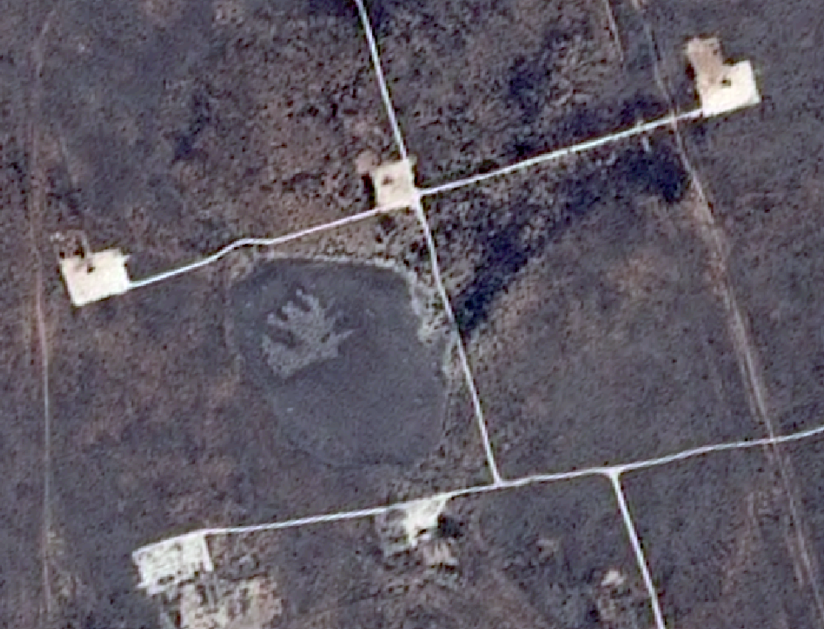

- Move across the image in a systematic pattern so as not to miss any well pads.
- Draw a shape around each of the well pads, sticking closely to the edges of the pad.
- If the well pad has a pond, include the pond in the shape. 
- Well pads should be tagged with shapes with as few corners as possible. This is likely to be somewhere between 4 and 16 corners, however more can be used for very complicated shaped well pads.
- Some well pads can appear in groups. Where possible, tag separate well pads with individual shapes. 
- When two well pads overlap do not draw overlapping polygons. Tag the parts of the well pad that can be seen.

## Examples

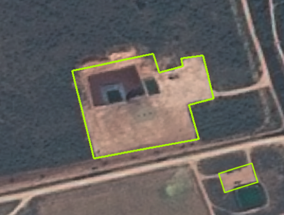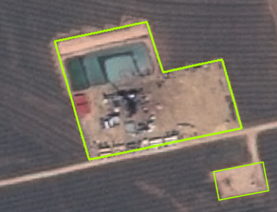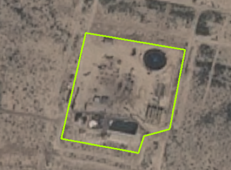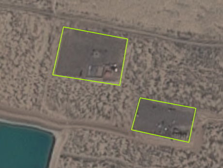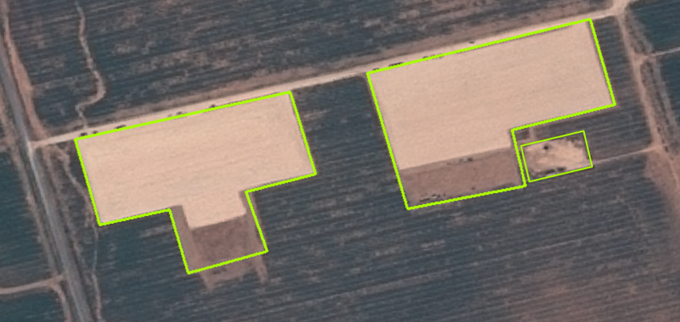

## Difficulties

Some well pads are difficult to identify. If in doubt about a particular object, tag it. It is better to over-tag than to miss well pads. 

Groups of touching well pads should be tagged with separate shapes where possible, as shown below.

Discard any well pads that are truncated at the border of the imagery. Do not discard a well pad that is not fully visible for other reasons (e.g. partially obscured by a newer well pad).

When two well pads overlap do not draw overlapping polygons. Tag the parts of the well pad that can be seen, as shown below.

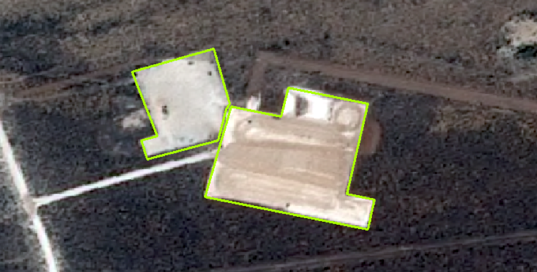

Light coloured, uneven areas like the one in the image below are excavation sites, such as mines or similar. These should not be tagged as well pads.

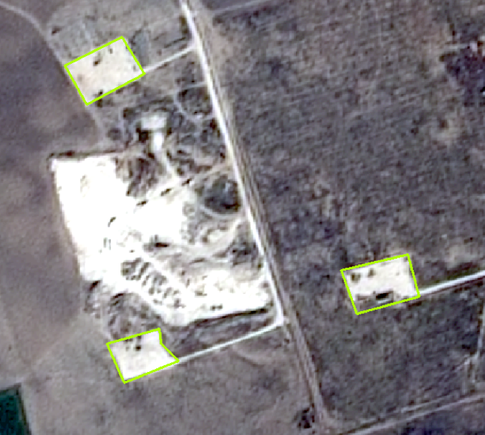

In the image above, three well pads can be seen and have been tagged, whereas the other lightly coloured area is larger than a typical well pad, varying in colour and of an unusual shape, suggesting that it is not a well pad. However, when in doubt about something in an image, tag it as over-tagging is preferable to missing well pads.

Very large areas of cleared ground, greater than around 200 pixels across, are not likely to be well pads. This can sometimes be recognised by the presence of permanent buildings and structures. An example is given below.

If it can be avoided, these large facilities should not be tagged, but once again if in doubt about something in an image, tag it.
