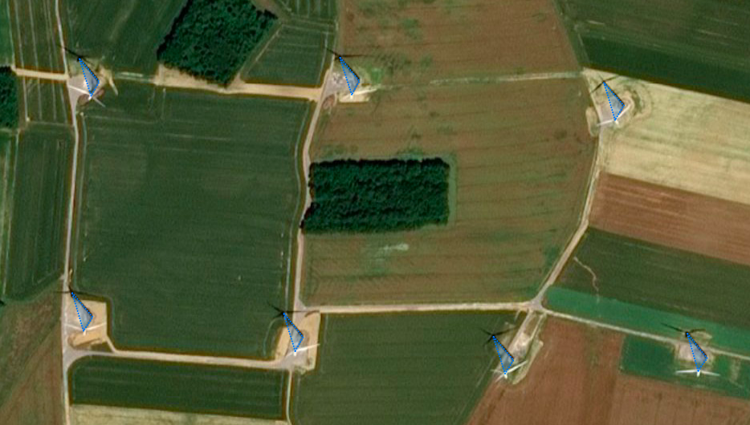
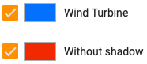
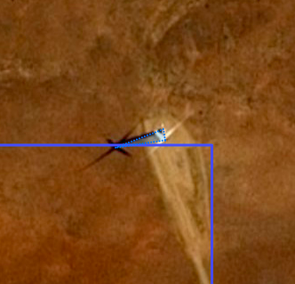

# Wind turbine tagging 

## Geometry

Wind turbines in the imagery should be identified with 3-points polygons. The polygon should be drawn with the following method: 

• Point 1 = top of the wind turbine \
• Point 2 = base of the wind turbine \
• Point 3 = top of the shadow 

 

## Classes

The wind turbine should be classified into the following 3 categories: 

• **Wind Turbine** 

If the object is clearly seen, you should only select the **Wind Turbine** annotation.

 

 

 

• **Wind Turbine without shadow** 

 

Sometimes, the shadow does not appear in the imagery (most of the time due to the clouds). You should select two annotations for the object: **Wind Turbine** and **Without shadow**.

Concerning the geometry, you should draw the polygon starting from the top of the object, then the base and guess where should be the last point according to others wind turbines next to the object in the imagery. Indeed all the shadows on an imagery have the same direction. 

 

• **Wind Turbine without body**

 

It is sometimes difficult to see the body of the wind turbine. In this case, you should select two annotations for the object: **Wind Turbine** and **Without body**.

Concerning the geometry, you should guess the first point (even if you are not sure) and complete the polygon with the base and the top of the shadow.
 
 
 

## Important notes

**Discard** any wind turbine that is truncated at the border of the imagery. **Do not discard** a wind turbine that is not fully visible for other reasons (i.e. partially covered by a cloud).

Sometimes the object is **not completely in the AOI** (Aera Of Interest). If almost one of the three points of the polygon is in the zone, you should annotate it.

 
 

Moreover, the top of the object, the base and the top of the shadow can be aligned. You should draw the polygon with the three points even if it is not a triangle. 

 
 

